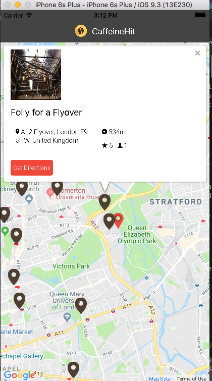

# Yelp Map [](https://travis-ci.org/NativeScript/sample-Groceries)

Yelp map is an Ionic Android/IOS that shows a map with a list of businesses represented by brown arrow markers. 


<h2 id="screenshots">Screenshots</h2>




<h2 id="development">Development</h2>

This app is built with the Ionic v1 CLI. Once you have the [CLI installed](https://ionicframework.com/docs/v1/), start by cloning the repo:


This installs ionic on your system including the CLI 
```
$ sudo npm install -g ionic cordova
```

```
$ git clone https://github.com/emodatt08/Yelp-Maps-App.git
$ cd <project name>
```

From there you can use the `rebuild` command to rebuild the project:

```
$ npm rebuild node-sass
```

then use `serve` command to run the project on your web browser:

```
$ ionic serve --lab
```

If you wish to run the project on an emulator run the commands below to add the specific  mobile platforms(Android/IOS):

```
$ ionic platform add ios
$ ionic build ios
$ ionic emulate ios
```

then use `run` command to run the project on your the emulator:

```
$ ionic cordova build ios
$ ionic cordova emulate ios
OR

$ ionic cordova build android
$ ionic cordova emulate android

```


For more information on testing and developing Ionic v1 apps, refer to the [Ionic v1 docs on the topic](https://ionicframework.com/docs/v1/guide/testing.html).
